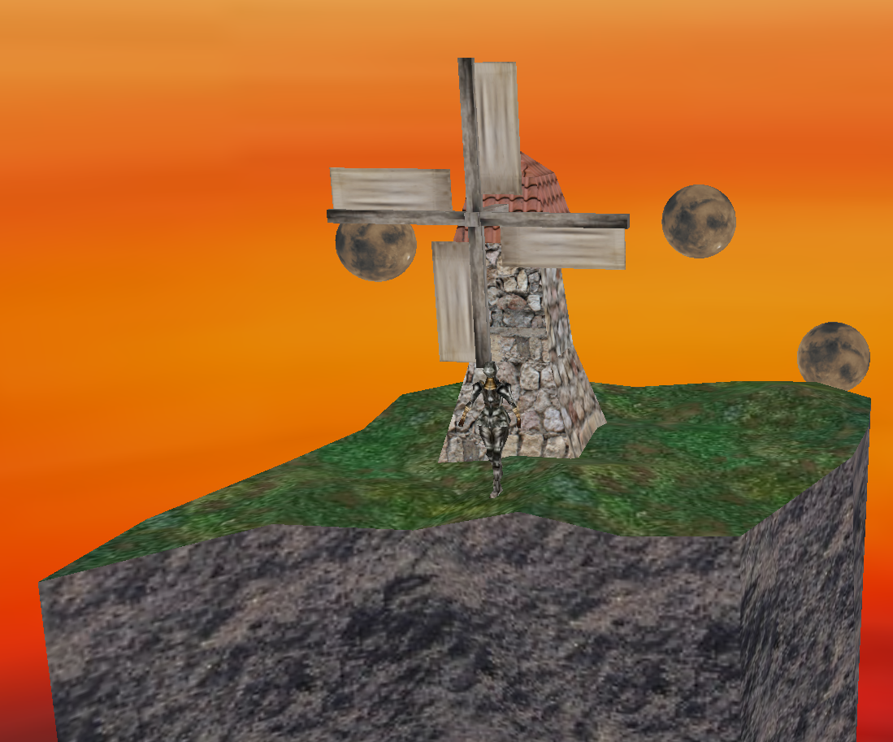

# Override3D
Override3D is a 3D rendering engine I'm in the process of creating, as of now it simply exists as a decent enough foundation and boilerplate (That being said, this is a **hobby project for my own experimentation and learning**, the implementation is really naive but I'm pretty proud of it). Gradually, it would become my sandbox of sorts to implement and learn more advanced graphical techniques, such as **PBR, volumetrics etc.**

This engine is being **made using OpenGL and C++**. A common theme in Override's codebase is the abundance of inheritance and virtualisation, so as to allow room for expansion, modifcation and specialised objects. Initially, I had planned to have a bunch of interfaces which would provide a common template for every single class in the engine, but that proved to be superfluous and cumbersome. Instead I went the regular inheritance route, having 'C' objects **(aka C-OMMON OBJECTS : CVertexBuffer, CMesh, CMaterial, CRenderable and so on.)** that would contain alot of the resuable and vital code. We can now derive from these classes and create specialty objects to suit our needs : **[AVertexBuffer (Animated Vertex Buffer), UIRenderable (A renderable that is used exclusively as a UI flat quad) and so on.]**

In its current state, the default shaders are pretty limited, mostly due to the fact that I haven't really focused my energy on the GPU side as of now, instead focusing on creating a sensible structure, which I would be able to add on top of, as I learn further. 

Feature List 
------
* Flexible rendering pipeline, the Renderer class draws "Renderables", containers that have a Mesh, Material and a Transform.
* The Mesh component must be provided a vector of "Vertex" objects , (a struct that defines a single vertex, consists of : Position, Normal and TexCoords). The Material class can be provided with textures, shaders, etc.The Textures can also be configured (filtering, mipmapping etc)
* Capable of loading various model types (OBJ, GLTF, ETC) using Assimp. 
* Simple Parenting system using Transforms
* Simple Scene System

TODO List 
------
* Adding light nodes, and lighting (along with better shaders)
* Blending and transparency
* Re-writing the Model Loader to be more reliable

